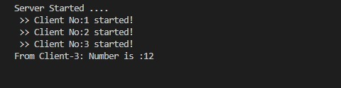
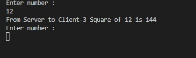
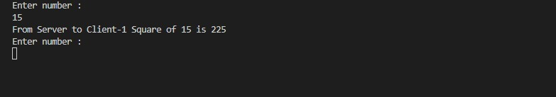
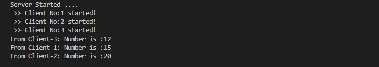
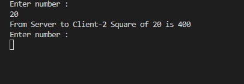

# Lab 2 - Cliente/Servidor con Sockets en Java

Este proyecto implementa un sistema de comunicación **Cliente/Servidor multihilo** en Java utilizando **sockets TCP**.  
Permite que múltiples clientes se conecten simultáneamente a un servidor y realicen operaciones de prueba de comunicación.

---
 ```
## 📂 Estructura del proyecto


lab\_2/
│── MultithreadedSocketServer.java   # Servidor principal (acepta múltiples clientes)
│── ServerClientThread.java          # Hilo que maneja cada cliente conectado
│── TCPClient.java                   # Cliente TCP para conectarse al servidor
│── inicioo.jpeg                     # Captura del inicio del servidor
│── clienteEJ12.jpeg                 # Ejecución cliente 1
│── clienteEJ15.jpeg                 # Ejecución cliente 2
│── clienteEJ20.jpeg                 # Ejecución cliente 3
│── clienteEJ21.jpeg                 # Ejecución cliente 4

 ```

---

## ⚙️ Compilación y ejecución

1. **Compilar todos los archivos Java**
   ```bash
   javac *.java


2. **Ejecutar el servidor**

   ```bash
   java MultithreadedSocketServer
   ```

3. **Ejecutar un cliente** en otra terminal (pueden abrirse varios a la vez)

   ```bash
   java TCPClient
   ```

---

## 🖼️ Demostración

### Inicio del servidor



### Ejemplo de ejecución cliente 1



### Ejemplo de ejecución cliente 2



### Ejemplo de ejecución cliente 3



### Ejemplo de ejecución cliente 4



---

## 📌 Notas

* El servidor está diseñado para aceptar múltiples clientes mediante **multithreading**.
* Cada cliente se atiende en un hilo independiente (`ServerClientThread`).
* Se puede extender para soportar operaciones adicionales además del eco o pruebas actuales.

---

## 👨‍💻 Autor

Proyecto desarrollado como parte del **Laboratorio 2 - Programación de Sockets en Java**.


